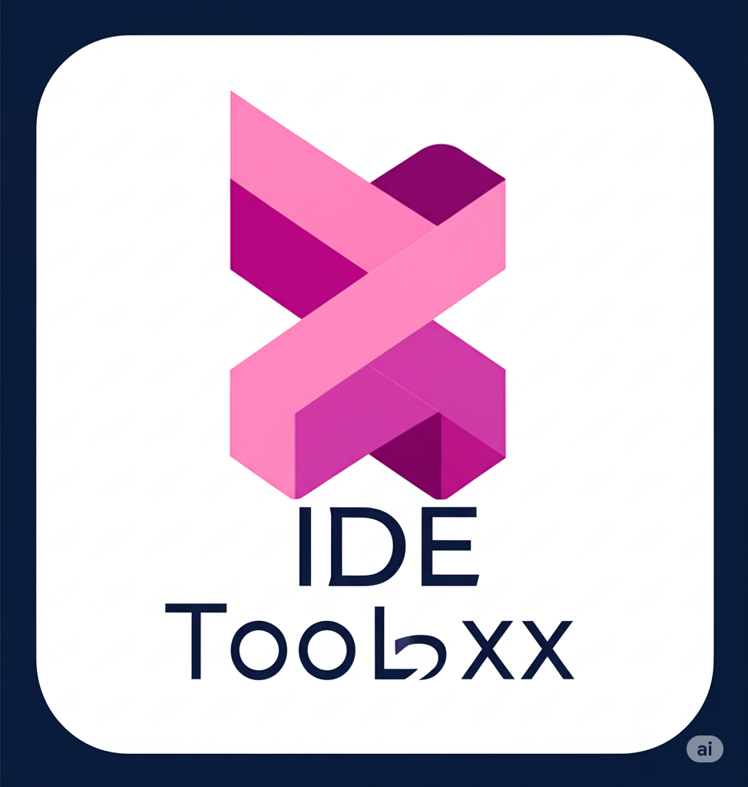

# IDE Toolbox

> ⚡️ Фановая IDE и менеджер проектов для Windows. Просто чтобы было! Не воспринимай всерьёз, но вдруг пригодится ;)

## Требования
- Node.js **24.0.0** или новее ([скачать Node.js](https://nodejs.org/))

## Скриншот



---

## Быстрый старт

### 1. Клонируй репозиторий
```sh
git clone https://github.com/<your-username>/<repo-name>.git
cd IDE-Toolbox
```

### 2. Установи зависимости
```sh
npm install
```

### 3. Запусти в режиме разработки
```sh
npm start
```

---

## Сборка под продакшн

Собираем инсталлятор для Windows:
```sh
npm run build
```

Файл появится в папке `dist/`.

---

## Что умеет эта штука?
- Управляет проектами (SQLite база)
- Логирует активность
- Красивый интерфейс на Electron
- Просто весело и удобно!

---

## Зависимости
- [Electron](https://www.electronjs.org/)
- [sqlite3](https://www.npmjs.com/package/sqlite3)
- [dayjs](https://www.npmjs.com/package/dayjs)
- [ps-list](https://www.npmjs.com/package/ps-list)

---

## Для кого это?
Для тех, кто любит пофаниться с кодом, не боится экспериментировать и хочет свою мини-IDE под Windows. Всё просто, без лишнего пафоса!

---

## Лицензия
ISC. Используй как хочешь, только не злись, если что-то сломается :) 